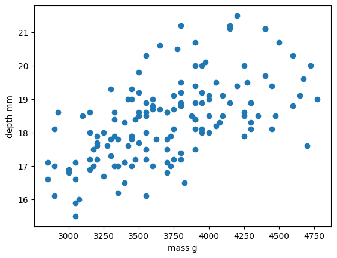
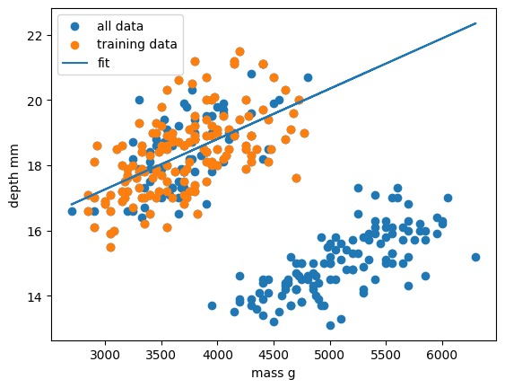
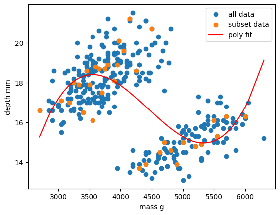

# Supervised learning

Classical machine learning is often divided into two categories – supervised and unsupervised learning.

For the case of supervised learning we act as a "supervisor" or "teacher" for our ML algorithms by providing the algorithm with "labelled data" that contains example answers of what we wish the algorithm to achieve.

For instance, if we wish to train our algorithm to distinguish between images of cats and dogs, we would provide our algorithm with images that have already been labelled as "cat" or "dog" so that it can learn from these examples. If we wished to train our algorithm to predict house prices over time we would provide our algorithm with example data of datetime values that are "labelled" with house prices.

Supervised learning is split up into two further categories: classification and regression. For classification the labelled data is discrete, such as the "cat" or "dog" example, whereas for regression the labelled data is continuous, such as the house price example.

In this episode we will explore how we can use regression to build a "model" that can be used to make predictions.

# Regression

Regression is a statistical technique that relates a dependent variable (a label or target variable in ML terms) to one or more independent variables (features in ML terms). A regression model attempts to describe this relation by fitting the data as closely as possible according to mathematical criteria. This model can then be used to predict new labelled values by inputting the independent variables into it. For example, if we create a house price model we can then feed in any datetime value we wish, and get a new house price value prediction.

Regression can be as simple as drawing a "line of best fit" through data points, known as linear regression, or more complex models such as polynomial regression, and is used routinely around the world in both industry and research. You may have already used regression in the past without knowing that it is also considered a machine learning technique!

## Linear regression using Scikit-Learn

We've had a lot of theory so time to start some actual coding! Let's create a regression model on some penguin data available through the Python plotting library [Seaborn](https://seaborn.pydata.org/). 

Let’s start by loading in and examining the penguin dataset, which containing a few hundred samples and a number of features and labels.

~~~
import seaborn as sns

dataset = sns.load_dataset("penguins")
print(dataset.shape)
dataset.head()
~~~
{: .language-python}

We can see that we have seven columns in total: 4 continuous (numerical) columns named `bill_length_mm`, `bill_depth_mm`, `flipper_length_mm`, and `body_mass_g`; and 3 discrete (categorical) columns named `species`, `island`, and `sex`. We can also see from a quick inspection of the first 5 samples that we have some missing data in the form of `NaN` values. Missing data is a fairly common occurrence in real-life data, so let's go ahead and remove any rows that contain `NaN` values:

~~~
dataset.dropna(inplace=True)
dataset.head()
~~~
{: .language-python}

In this scenario we will train a linear regression model using `body_mass_g` as our feature data and `bill_depth_mm` as our label data. We will train our model on a subset of the data by slicing the first 146 samples of our cleaned data. 

In machine learning we often train our models on a subset of data, for reasons we will explain later in this lesson, so let us extract a subset of data to work on by slicing the first 146 samples of our cleaned data and extracting our feature and label data:

~~~
import matplotlib.pyplot as plt

train_data = dataset[:146] # first 146 rows

x_train = train_data["body_mass_g"]
y_train = train_data["bill_depth_mm"]

plt.scatter(x_train, y_train)
plt.xlabel("mass g")
plt.ylabel("depth mm")
plt.show()
~~~
{: .language-python}

In this regression example we will create a Linear Regression model that will try to predict `y` values based upon `x` values.

In machine learning terminology: we will use our `x` feature (variable) and `y` labels(“answers”) to train our Linear Regression model to predict `y` values when provided with `x` values.

The mathematical equation for a linear fit is `y = mx + c` where `y` is our label data, `x` is our input feature(s), `m` represents the slope of the linear fit, and `c` represents the intercept with the y-axis.

A typical ML workflow is as following:

* Decide on a model to use model (also known as an estimator)
* Tweak your data into the required format for your model
* Define and train your model on the input data
* Predict some values using the trained model
* Check the accuracy of the prediction, and visualise the result

We have already decided to use a linear regression model, so we’ll now pre-process our data into a format that Scikit-Learn can use.

~~~
import numpy as np

# sklearn requires a 2D array, so lets reshape our 1D arrays from (N) to (N,).
x_train = np.array(x_train).reshape(-1, 1)
y_train = np.array(y_train).reshape(-1, 1)
~~~
{: .language-python}

Next we’ll define a model, and train it on the pre-processed data. We’ll also inspect the trained model parameters m and c:

~~~
from sklearn.linear_model import LinearRegression

# Define our estimator/model
model = LinearRegression(fit_intercept=True)

# train our estimator/model using our data
lin_regress = model.fit(x_train,y_train)

# inspect the trained estimator/model parameters
m = lin_regress.coef_
c = lin_regress.intercept_
print("linear coefs=",m, c)
~~~
{: .language-python}

Now we can make predictions using our trained model, and calculate the Root Mean Squared Error (RMSE) of our predictions:

~~~
import math
from sklearn.metrics import mean_squared_error

# Predict some values using our trained estimator/model.
# In this case we predict our input data to evaluate accuracy!
linear_data = lin_regress.predict(x_train)

# calculated a RMS error as a quality of fit metric
error = math.sqrt(mean_squared_error(y_train, linear_data))
print("linear error=",error)
~~~
{: .language-python}

Finally, we’ll plot our input data, our linear fit, and our predictions:

~~~
plt.scatter(x_train, y_train, label="input")
plt.plot(x_train, linear_data, "-", label="fit")
plt.plot(x_train, linear_data, "rx", label="predictions")
plt.xlabel("body_mass_g")
plt.ylabel("bill_depth_mm")
plt.legend()
plt.show()
~~~
{: .language-python}

Congratulations! We've now created our first machine-learning model of the lesson and we can now make predictions of `bill_depth_mm` for any `body_mass_g` values that we pass into our model.

Let's provide the model with all of the penguin samples and see how our model performs on the full dataset:

~~~
# Extract the relevant features and labels from our complete dataset
x_train_all = dataset["body_mass_g"]
y_train_all = dataset["bill_depth_mm"]

# sklearn requires a 2D array, so lets reshape our 1D arrays from (N) to (N,).
x_train_all = np.array(x_train_all).reshape(-1, 1)
y_train_all = np.array(y_train_all).reshape(-1, 1)

# Predict values using our trained estimator/model from earlier
linear_data_all = lin_regress.predict(x_train_all)

# calculated a RMS error for all data
error_all = math.sqrt(mean_squared_error(y_train_all, linear_data_all))
print("linear error=",error_all)
~~~
{: .language-python}

Our RMSE for predictions on all penguin samples is far larger than before, so let's visually inspect the situation:

~~~
plt.scatter(x_train_all, y_train_all, label="all data")
plt.scatter(x_train, y_train, label="training data")

plt.plot(x_train_all, linear_data_all, label="fit")

plt.xlabel("mass g")
plt.ylabel("depth mm")
plt.legend()
plt.show()
~~~
{: .language-python}

Oh dear. It looks like our linear regression fits okay for our subset of the penguin data, and a few additional samples, but there appears to be a cluster of points that are poorly predicted by our model. Even if we re-trained our model using all samples it looks unlikely that our model would perform much better due to the two-cluster nature of our dataset.

> ## This is a classic Machine Learning scenario known as over-fitting
> We have trained our model on a specific set of data, and our model has learnt to reproduce those specific answers at the expense of creating a more generally-applicable model.
> Over fitting is the ML equivalent of learning an exam papers mark scheme off by heart, rather than understanding and answering the questions.
{: .callout}

In this episode we chose to create a regression model for `bill_depth_mm` versus `body_mass_g` predictions without understanding our penguin dataset. While we proved we *can* make a model by doing this we also saw that the model is flawed due to complexity in the data that we did not account for. 

With enough data and by using more complex regression models we *may* be able to create a generalisable `bill_depth_mm` versus `body_mass_g` model for penguins, but it's important to be aware that some problems simply might not be solvable with the data quantity or features that you have. 

In the next episode we will take a deeper dive into the penguin dataset as we attempt to create classification models for penguin species. 

## Repeating the regression with different estimators

The goal of this lesson isn't to build a generalisable `bill_depth_mm` versus `body_mass_g` model for the penguin dataset - the goal is to give you some hands-on experience building machine learning models with scikit-learn. So let's repeat the above but this time using a polynomial function. 

Polynomial functions are non-linear functions that are commonly-used to model data. Mathematically they have `N` degrees of freedom and they take the following form `y = a + bx + cx^2 + dx^3 ... + mx^N`. If we have a polynomial of degree `N=1` we once again return to a linear equation `y = a + bx` or as it is more commonly written `y = mx + c`.

We'll follow the same workflow from before:
* Decide on a model to use model (also known as an estimator)
* Tweak your data into the required format for your model
* Define and train your model on the input data
* Predict some values using the trained model
* Check the accuracy of the prediction, and visualise the result

We've decided to use a Polynomial estimator, so now let's tweak our dataset into the required format. For polynomial estimators in Scikit-Learn this is done in two steps. First we pre-process our input data `x_train` into a polynomial representation using the `PolynomialFeatures` function. Then we can create our polynomial regressions using the `LinearRegression().fit()` function as before, but this time using the polynomial representation of our `x_train`.

~~~
from sklearn.preprocessing import PolynomialFeatures

# Requires sorted data for ordered polynomial lines 
dataset = dataset.sort_values("body_mass_g")
x_train = dataset["body_mass_g"]
y_train = dataset["bill_depth_mm"]
x_train = np.array(x_train).reshape(-1, 1)
y_train = np.array(y_train).reshape(-1, 1)

# create our training subset from every 10th sample
x_train_subset = x_train[::10]
y_train_subset = y_train[::10]

# create a polynomial representation of our training data
poly_features = PolynomialFeatures(degree=3)
x_poly = poly_features.fit_transform(x_train_subset)
~~~
{: .language-python}

> ## We convert a non-linear problem into a linear one
> By converting our input feature data into a polynomial representation we can now solve our non-linear problem using linear techniques. This is a common occurence in machine learning as linear problems are far easier computationally to solve. We can treat this as just another pre-processing step to manipulate our features into a ML-ready format.
{: .callout}

We are now ready to create and train our model using our polynomial feature data. 

~~~
# Define our estimator/model(s) and train our model
poly_regress = LinearRegression()
poly_regress.fit(x_poly,y_train_subset)
~~~
{: .language-python}

We can now make predictions using our full dataset. As we did for our training data, we need to quickly transform our full dataset into a polynomial expression. Then we can evaluate the RMSE of our predictions.

~~~
# make predictions using all data, pre-process data too
x_poly_all = poly_features.fit_transform(x_train)
poly_train = poly_regress.predict(x_poly_all)

poly_error = math.sqrt(mean_squared_error(y_train, poly_train))
print("poly error=", poly_error)
~~~
{: .language-python}

Finally, let's visualise our model fit on our training data and full dataset.

~~~
plt.scatter(x_train, y_train, label="all data")
plt.scatter(x_train_subset, y_train_subset, label="subset data")

plt.plot(x_train, poly_train, "r-", label="poly fit")
plt.xlabel("mass g")
plt.ylabel("depth mm")
plt.legend()
plt.show()
~~~
{: .language-python}

> ## Exercise: Vary your polynomial degree to try and improve fitting
> Adjust the `degree=2` input variable for the `PolynomialFeatures` function to change the degree of polynomial fit. Can you improve the RMSE of your model?
> > ## Solution
> > MAYBE A FIGURE OR TWO. POTENTIALLY SOME CODE TO LOOP OVER POLYNOMIALS.
> {: .solution}
{: .challenge}

> ## Exercise: Now try using the SplineTransformer to create a spline model
> The SplineTransformer is another pre-processing function that behaves in a similar way to the PolynomialFeatures function. Adjust your
> previous code to use the SplineTransformer. Can you improve the RMSE of your model by varying the `knots` and `degree` functions? Is the spline model better than the polynomial model?
> > ## Solution
> > ~~~
> > spline_features =  SplineTransformer(n_knots=3, degree=2)
> > ~~~
> > {: .language-python}
> >
> > The above line replaces the `PolynomialFeatures` function. It takes in an additional argument `knots` compared to `PolynomialFeatures`.
> > ADD LINES OR FIGURES TO EXPLORE THIS.
> > SOME COMMENT ON FITS AND MODEL COMPARISON.
> {: .solution}
{: .challenge}


